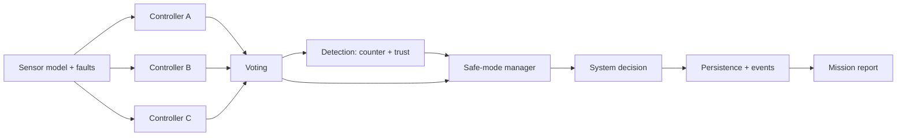

# SentinelNav

A deterministic, fault-tolerant control-system simulation. Three
redundant controllers process noisy sensor data, vote by majority, and
escalate through `NORMAL → DEGRADED → SAFE_MODE → FAILED` as fault
detection erodes trust. Every decision is reproducible from a seed and
every step is logged for audit. The repo ships a Python/FastAPI backend
with SQLite persistence and a Next.js + TypeScript dashboard.

## Why this exists

Aerospace, defense, automotive, and medical systems frequently rely on
triple-redundant controllers with majority voting and explicit safe-mode
behavior. SentinelNav is a small, inspectable test bed for that
pattern: scenarios are reproducible, faults are first-class, and the
mission report explains *why* the system behaved the way it did.

## Architecture

```
client (Next.js) ──► FastAPI ──► Simulation orchestrator
                                  ├─ vehicle state engine
                                  ├─ sensor model (with noise + fault hooks)
                                  ├─ controllers A / B / C (different logic)
                                  ├─ majority voting
                                  ├─ legacy fault detector (counter-based)
                                  ├─ trust detector (windowed + recovery)
                                  ├─ safe-mode manager
                                  └─ append-only event logger
                                         │
                                       SQLite
                                         │
                                  reporting / scenarios
```



## Features

- Three differing controllers (Conservative, Responsive, Balanced)
- Deterministic vehicle state engine + Gaussian sensor model
- Majority voting with invalid/late exclusion
- Counter-based + time-windowed trust detection
- Safe-mode escalation with action restriction and recovery cooldown
- 14 fault types (sensor and controller, with intermittent patterns)
- 6 built-in scenarios (`nominal_cruise` through `multi_fault_failure`)
- SQLite persistence + full timeline reconstruction
- Mission report (JSON + Markdown) with risk assessment
- FastAPI app with consistent error contract and CORS
- Next.js dashboard: simulations, scenarios, replay, report

## Backend routes

See [`docs/API.md`](docs/API.md) for the full list. Highlights:

```
POST   /simulations
POST   /simulations/{id}/step
POST   /simulations/{id}/faults
GET    /simulations
GET    /simulations/{id}
GET    /simulations/{id}/timeline
GET    /simulations/{id}/report
GET    /simulations/{id}/report/markdown
GET    /scenarios
POST   /scenarios/{name}/run
POST   /scenarios/{name}/run/{steps}
```

## Scenario examples

```bash
curl -XPOST http://localhost:8000/scenarios/nominal_cruise/run/10
curl -XPOST http://localhost:8000/scenarios/multi_fault_failure/run/15
```

See [`docs/SCENARIOS.md`](docs/SCENARIOS.md) for what each scenario
exercises and the expected mode trajectory.

## Fault model examples

```jsonc
{
  "type": "CONTROLLER_LATENCY",
  "target": "controller_b",
  "start_step": 4,
  "duration": 8,
  "metadata": { "latency_ms": 250 }
}
```

```jsonc
{
  "type": "SENSOR_DROPOUT",
  "target": "sensor",
  "start_step": 3,
  "duration": 20,
  "metadata": { "probability": 0.6 }
}
```

Full taxonomy in [`docs/FAULT_MODEL.md`](docs/FAULT_MODEL.md).

## Screenshots

_Screenshots placeholder — capture after running locally._

- Landing page (`/`)
- Dashboard (`/dashboard`)
- Scenarios (`/scenarios`)
- Simulation detail (`/simulations/{id}`)
- Replay (`/simulations/{id}/replay`)
- Mission report (`/simulations/{id}/report`)

## Local setup

Backend:

```bash
cd backend
pip install -r requirements.txt
uvicorn app.main:app --reload
pytest -q
```

Frontend:

```bash
cd frontend
cp .env.example .env.local
npm install
npm run dev
```

Open http://localhost:3000.

## Deployment

```bash
docker compose up --build
```

See [`docs/DEPLOYMENT.md`](docs/DEPLOYMENT.md).

## Tests

```bash
cd backend
pytest -q
```

The suite covers voting, controller behavior, fault detection,
trust/health logic, safe mode, simulation determinism, persistence
recovery, timeline reconstruction, scenario determinism, advanced
faults, mission reports, and API contracts.

## Portfolio positioning

SentinelNav is intentionally small in scope but rich in the details
that real safety-critical systems demand: determinism, redundancy,
explainable failure, persistence, and an auditable timeline. It
demonstrates the ability to take a system-design problem and ship a
clean backend, a typed API, a usable UI, and a paper trail end-to-end.
See [`docs/PORTFOLIO_CASE_STUDY.md`](docs/PORTFOLIO_CASE_STUDY.md) for
the case-study write-up.
