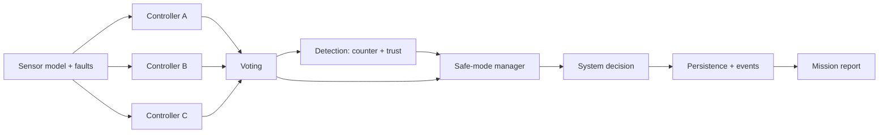

# DriftGuard

A deterministic, fault-tolerant control-system simulation. Three
redundant controllers process noisy sensor data, vote by majority, and
escalate through `NORMAL → DEGRADED → SAFE_MODE → FAILED` as fault
detection erodes trust. Every decision is reproducible from a seed and
every step is logged for audit. The repo ships a Python/FastAPI backend
with SQLite persistence and a Next.js + TypeScript dashboard.

## What this is (and isn't)

DriftGuard is a portfolio simulation of the redundancy and safe-mode
patterns used in mission-critical control systems. It is built to be
*inspectable*: deterministic replay, falsifiable claims, ADR-backed
decisions, and a TLA+ spec for the safe-mode transition function.

It is **not** flight-certified software, a SaaS product, or a real
hardware control loop. Production-boundary callouts in this README and
in [`docs/DEPLOYMENT.md`](docs/DEPLOYMENT.md) are deliberate; promoting
the system past them is real engineering work, not a config flip.

## Documentation map

| Topic | Document |
| --- | --- |
| High-level architecture | [`ARCHITECTURE.md`](ARCHITECTURE.md) |
| Block diagram (audited against source) | [`docs/ARCHITECTURE_DIAGRAM.md`](docs/ARCHITECTURE_DIAGRAM.md) |
| Portfolio case study | [`docs/PORTFOLIO_CASE_STUDY.md`](docs/PORTFOLIO_CASE_STUDY.md) |
| Live demo walkthrough | [`docs/DEMO_SCRIPT.md`](docs/DEMO_SCRIPT.md) |
| Determinism / replay audit | [`docs/DETERMINISM.md`](docs/DETERMINISM.md) |
| API surface | [`docs/API.md`](docs/API.md) |
| Built-in scenarios | [`docs/SCENARIOS.md`](docs/SCENARIOS.md) |
| Fault model | [`docs/FAULT_MODEL.md`](docs/FAULT_MODEL.md) |
| Physics / dynamics / EKF | [`docs/PHYSICS.md`](docs/PHYSICS.md) |
| Numbered invariants (I1–I11) | [`docs/INVARIANTS.md`](docs/INVARIANTS.md) |
| Observability (events / metrics / traces) | [`docs/OBSERVABILITY.md`](docs/OBSERVABILITY.md) |
| Local + Compose deployment | [`docs/DEPLOYMENT.md`](docs/DEPLOYMENT.md) |
| Railway deployment runbook | [`docs/RAILWAY_DEPLOY.md`](docs/RAILWAY_DEPLOY.md) |
| Architecture decision records | [`docs/adr/`](docs/adr) |
| TLA+ specification | [`docs/formal/SafeMode.tla`](docs/formal/SafeMode.tla) |
| Whitepaper (predates rename) | [`RESEARCH.md`](RESEARCH.md) |
| Changelog | [`CHANGELOG.md`](CHANGELOG.md) |

<details>
<summary><strong>Claim audit (verified at HEAD)</strong></summary>

| Claim | Verdict | Action |
| --- | --- | --- |
| 630 backend tests, 97% line coverage | true | `python -m pytest -q` → 630 passed, 11 deselected; `--cov=app` → TOTAL 97% |
| TLA+ spec mirrored by exhaustive Python checker | true | [`docs/formal/SafeMode.tla`](docs/formal/SafeMode.tla); checker at [`backend/app/tests/properties/test_transition_exhaustive.py`](backend/app/tests/properties/test_transition_exhaustive.py) |
| Hypothesis-driven property tests for invariants I1–I9 | corrected | Spec lists I1–I11 ([`docs/INVARIANTS.md`](docs/INVARIANTS.md)); README updated to I1–I11 |
| Subprocess fuzz harness for safe-mode escapes | true | [`backend/app/tests/fuzz/test_orchestrator_no_escape.py`](backend/app/tests/fuzz/test_orchestrator_no_escape.py) |
| Canonical replay fingerprint (SHA-256) | true | [`backend/app/core/canonical.py`](backend/app/core/canonical.py); endpoint `GET /simulations/{id}/replay-fingerprint` |
| Causality fields on every decision | true | `previous_mode`, `trigger_reason`, `active_fault_ids`, `detector_findings`, `vote_split`; mapped in [`docs/API.md`](docs/API.md) |
| Bearer-token guard on writes via `SENTINEL_API_TOKEN` | true | [`backend/app/api/auth.py`](backend/app/api/auth.py); reads are open by design |
| Sliding-window rate limiter | true | [`backend/app/api/rate_limit.py`](backend/app/api/rate_limit.py); per-process, see Production boundaries |
| Single-replica deployment | true | `numReplicas = 1` in [`backend/railway.toml`](backend/railway.toml) and [`frontend/railway.toml`](frontend/railway.toml) |
| WAL-mode SQLite at `/data/driftguard.db` | corrected | Path was `sentinelnav.db` in README; matches [`docker-compose.yml`](docker-compose.yml) |
| Supply-chain CI (Trivy + CycloneDX SBOMs) | true | [`.github/workflows/supply-chain.yml`](.github/workflows/supply-chain.yml) — runs trivy fs scan + syft for backend & frontend |
| Backend CI (ruff, bandit, pip-audit, pytest --cov) | true | [`.github/workflows/backend.yml`](.github/workflows/backend.yml) |
| Prometheus `/metrics` + OTEL traces | true | See [`docs/OBSERVABILITY.md`](docs/OBSERVABILITY.md) |
| 15 fault types with intermittent patterns / DSL | true | `FaultType` enum in [`backend/app/domain/enums.py`](backend/app/domain/enums.py); 15 members |
| Architecture Decision Records | true | [`docs/adr/`](docs/adr) — 11 numbered ADRs (0001–0011) plus a template |

</details>

## Why this exists

Aerospace, defense, automotive, and medical systems frequently rely on
triple-redundant controllers with majority voting and explicit safe-mode
behavior. DriftGuard is a small, inspectable test bed for that
pattern: scenarios are reproducible, faults are first-class, and the
mission report explains *why* the system behaved the way it did.

## Architecture

The full block diagram (frontend, API layer, scenario runner, simulation
orchestrator, sensor model, redundant controllers, voter, detector,
safe-mode manager, persistence, replay fingerprint path, observability)
lives in [`docs/ARCHITECTURE_DIAGRAM.md`](docs/ARCHITECTURE_DIAGRAM.md).
The summary view of the step loop:



## Features

### Core simulation
- Three differing controllers (Conservative, Responsive, Balanced)
- Deterministic vehicle state engine + Gaussian sensor model
- **INS / GPS / EKF filtering pipeline with GPS-denied handling** —
  runs by default; legacy direct-`SensorModel` mode available via
  `SimulationConfig.navigation_pipeline_enabled = False` for the
  unit-test baseline that pins `SensorModel` directly. See ADR 0010.
- Continuous-time dynamics integrator available as an alternative to
  the discrete kinematic update; opt-in via
  `SimulationConfig.use_substep_integrator = True` (ADR 0007). Default
  off to keep replay fingerprints stable.
- Majority voting with invalid/late exclusion
- Counter-based + time-windowed trust detection with per-component
  health states (`HEALTHY` → `SUSPECT` → `DEGRADED` → `CRITICAL` →
  `RECOVERING`)
- **Safe-mode escalation with action restriction and recovery
  hysteresis** — escalations are immediate; de-escalations require
  `safe_mode_recovery_steps` consecutive proposals of the
  same-or-less-severe mode. See ADR 0011 / I11.
- 15 fault types (sensor and controller, with intermittent patterns
  and a metadata DSL that supports linear ramps)
- 10 built-in scenarios plus a YAML scenario authoring surface with
  run-time parameter overrides
- SQLite persistence + full timeline reconstruction
- Mission report (JSON + Markdown) with risk assessment

### Determinism & verification
- Canonical replay fingerprint (SHA-256 over a scrubbed timeline) —
  see [`backend/app/core/canonical.py`](backend/app/core/canonical.py)
- Replay-equivalence harness — same seed + same scenario produces a
  byte-identical run hash across processes
- Hypothesis-driven property tests for invariants I1–I11
  ([`docs/INVARIANTS.md`](docs/INVARIANTS.md))
- TLA+ formal spec ([`docs/formal/SafeMode.tla`](docs/formal/SafeMode.tla))
  mirrored by an exhaustive Python checker
  ([`backend/app/tests/properties/test_transition_exhaustive.py`](backend/app/tests/properties/test_transition_exhaustive.py))
- 1000-step soak tests across every scenario, asserting invariants
- Subprocess fuzz harness that hunts for safe-mode escapes
  ([`backend/app/tests/fuzz/test_orchestrator_no_escape.py`](backend/app/tests/fuzz/test_orchestrator_no_escape.py))
- 630 backend tests, 97% line coverage (`pytest -q` default; 11 opt-in
  slow tests excluded by the `slow` marker)

### API, observability, and ops
- FastAPI app with typed schemas, consistent error taxonomy, CORS
  allowlist, optional bearer-token guard on writes, rate limiter,
  per-simulation step + fault caps, and LRU eviction on the in-memory
  registry
- Prometheus `/metrics` endpoint and OpenTelemetry tracing on the
  step loop
- Server-Sent-Events stream of live simulation state
- Anomaly-detection sidecar (isolation forest) wired alongside the
  deterministic detector — advisory only, never gates the decision
- Next.js + TypeScript dashboard: landing, simulations, scenarios,
  replay, mission report, scenario authoring; trajectory map, charts,
  and print-friendly report styles

## Backend routes

See [`docs/API.md`](docs/API.md) for the full list. Highlights:

```
POST   /simulations
POST   /simulations/{id}/step
POST   /simulations/{id}/faults
GET    /simulations
GET    /simulations/{id}
GET    /simulations/{id}/timeline
GET    /simulations/{id}/report
GET    /simulations/{id}/report/markdown
GET    /simulations/{id}/replay-fingerprint
GET    /simulations/{id}/stream            # SSE
GET    /scenarios
POST   /scenarios                          # YAML body
POST   /scenarios/{name}/run
POST   /scenarios/{name}/run/{steps}
GET    /metrics                            # Prometheus
GET    /health
```

## Scenario examples

```bash
curl -XPOST http://localhost:8000/scenarios/nominal_cruise/run/10
curl -XPOST http://localhost:8000/scenarios/multi_fault_failure/run/15
```

See [`docs/SCENARIOS.md`](docs/SCENARIOS.md) for what each scenario
exercises and the expected mode trajectory.

## Fault model examples

```jsonc
{
  "type": "CONTROLLER_LATENCY",
  "target": "controller_b",
  "start_step": 4,
  "duration": 8,
  "metadata": { "latency_ms": 250 }
}
```

```jsonc
{
  "type": "SENSOR_DROPOUT",
  "target": "sensor",
  "start_step": 3,
  "duration": 20,
  "metadata": { "probability": 0.6 }
}
```

Full taxonomy in [`docs/FAULT_MODEL.md`](docs/FAULT_MODEL.md).

## Live demo walkthrough

A step-by-step demo script — sensor-drift run → DEGRADED → controller
fault injection → SAFE_MODE → replay-fingerprint check — lives at
[`docs/DEMO_SCRIPT.md`](docs/DEMO_SCRIPT.md).

## Local setup

Backend:

```bash
cd backend
pip install -r requirements.txt
uvicorn app.main:app --reload
pytest -q
```

Frontend:

```bash
cd frontend
cp .env.example .env.local
npm install
npm run dev
```

Open http://localhost:3000.

## Deployment

```bash
docker compose up --build
```

A named `sentinel-data` volume (kept under its legacy name for
backup-script compatibility) is mounted at `/data` so simulations
survive container restart — the backend writes a WAL-mode SQLite
database at `/data/driftguard.db`. See
[`docs/DEPLOYMENT.md`](docs/DEPLOYMENT.md) for the full env-var
matrix, backup commands, and the smoke-test recipe.

### Deploying to Railway

A complete deployment runbook lives at
[`docs/RAILWAY_DEPLOY.md`](docs/RAILWAY_DEPLOY.md). It covers the
two-service topology (backend + frontend), the persistent volume,
the cross-service env wiring, and the smoke test. Expected total
time: under 10 minutes from a fresh Railway account.

## Tests

```bash
cd backend
pytest -q                       # full suite (630 tests, ~9s)
pytest --cov=app -q             # with coverage (currently 97% line)
pytest -m slow                  # opt-in fuzz / soak / property tests
```

The suite covers voting, controller behavior, fault detection,
trust/health logic, safe mode, simulation determinism, persistence
recovery, timeline reconstruction, scenario determinism, advanced
faults, mission reports, API contracts, invalid input rejection,
replay fingerprinting, anomaly firewall, and the structured-logging
contract. Property tests (`hypothesis`) and 1000-step soak runs are
opt-in via the `slow` marker.

CI also runs `ruff check`, `ruff format --check`, `bandit`,
`pip-audit`, plus weekly `trivy` filesystem scans and CycloneDX
SBOM generation for both the backend and frontend.

## Non-goals

Deliberate non-goals at 0.3.0. These are not gaps; the
[Production boundaries](#production-boundaries) section enumerates
the operational consequences.

- **Multi-replica horizontal scaling.** Single-process is the right
  size for a portfolio demo. Lifting this requires shared state
  (Redis) for the rate limiter and a non-SQLite persistence layer.
- **PostgreSQL backend.** SQLite + WAL is a deliberate choice
  ([ADR 0003](docs/adr/0003-sqlite-not-postgres.md)).
- **Real hardware control.** Per [`RESEARCH.md`](RESEARCH.md) §13,
  the simulation models the flight-software side; nothing here is
  meant to fly anything.
- **Distributed model checking.** Phase 9 ships a TLA+ spec mirrored
  by an exhaustive Python checker; running `tlc` as a CI job is a
  later polish item, not a 0.3.0 requirement.
- **SLOs / error budgets.** Out of scope for a portfolio simulator.

## Further reading

The capability-to-source map and the "what this demonstrates" write-up
live in [`docs/PORTFOLIO_CASE_STUDY.md`](docs/PORTFOLIO_CASE_STUDY.md).
For the formal-spec mirror, see
[`docs/INVARIANTS.md`](docs/INVARIANTS.md); for the
events / metrics / traces signal map,
[`docs/OBSERVABILITY.md`](docs/OBSERVABILITY.md).

## Production boundaries

DriftGuard is a single-replica portfolio system, not a multi-tenant
SaaS. The following limits are deliberate and documented; promoting
the system past them is a real piece of work, not a config flip.

- **Single-replica assumption.** The simulation registry, sliding-
  window rate limiter, and LRU eviction queue all live in-process. A
  multi-replica deployment would shard simulations across replicas
  (the registry is not consistent between them) and would need a
  shared store like Redis for the rate limiter to be effective.
  Railway deploys are pinned to one replica per service —
  `numReplicas = 1` in both [`backend/railway.toml`](backend/railway.toml)
  and [`frontend/railway.toml`](frontend/railway.toml).
- **SQLite single-writer caveat.** Persistence uses WAL-mode SQLite
  with a single writer, which is correct for a single backend
  process. Horizontal scale requires PostgreSQL plus connection
  pooling and migrations. The trade-off was made deliberately for
  demo scope ([ADR 0003](docs/adr/0003-sqlite-not-postgres.md)).
- **Demo auth boundary.** The bearer-token guard on writes
  (`SENTINEL_API_TOKEN` — legacy env-var name kept for compat,
  documented in [`backend/app/api/auth.py`](backend/app/api/auth.py))
  is a single shared secret. Reads are open by design so observability
  tools can scrape without auth. Multi-tenant production would require
  per-tenant identity, RBAC, and signed reads — none of which are in
  scope here.
- **In-memory rate limiter.** The sliding-window limiter
  ([`backend/app/api/rate_limit.py`](backend/app/api/rate_limit.py))
  is per-process state with no cross-replica coordination. With one
  replica it is correct; with N replicas the effective limit becomes
  N × the configured limit.
- **Out of scope.** Real hardware control, distributed `tlc` model
  checking, SLOs / error budgets, and multi-tenant production. The
  [Non-goals](#non-goals) section is the source of truth; this
  section is the operator-facing summary.
