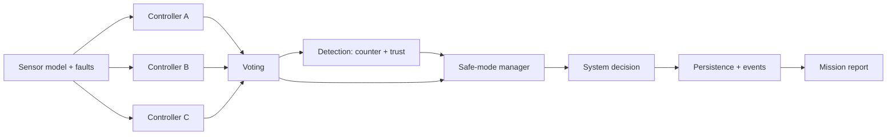

# SentinelNav

A deterministic, fault-tolerant control-system simulation. Three
redundant controllers process noisy sensor data, vote by majority, and
escalate through `NORMAL → DEGRADED → SAFE_MODE → FAILED` as fault
detection erodes trust. Every decision is reproducible from a seed and
every step is logged for audit. The repo ships a Python/FastAPI backend
with SQLite persistence and a Next.js + TypeScript dashboard.

## Why this exists

Aerospace, defense, automotive, and medical systems frequently rely on
triple-redundant controllers with majority voting and explicit safe-mode
behavior. SentinelNav is a small, inspectable test bed for that
pattern: scenarios are reproducible, faults are first-class, and the
mission report explains *why* the system behaved the way it did.

## Architecture

```
client (Next.js) ──► FastAPI ──► Simulation orchestrator
                                  ├─ vehicle state engine
                                  ├─ sensor model (with noise + fault hooks)
                                  ├─ controllers A / B / C (different logic)
                                  ├─ majority voting
                                  ├─ legacy fault detector (counter-based)
                                  ├─ trust detector (windowed + recovery)
                                  ├─ safe-mode manager
                                  └─ append-only event logger
                                         │
                                       SQLite
                                         │
                                  reporting / scenarios
```



## Features

### Core simulation
- Three differing controllers (Conservative, Responsive, Balanced)
- Deterministic vehicle state engine + Gaussian sensor model
- INS / GPS / EKF filtering pipeline with GPS-denied handling
- Majority voting with invalid/late exclusion
- Counter-based + time-windowed trust detection with per-component
  health states (`HEALTHY` → `SUSPECT` → `DEGRADED` → `CRITICAL` →
  `RECOVERING`)
- Safe-mode escalation with action restriction and recovery cooldown
- 15 fault types (sensor and controller, with intermittent patterns
  and a metadata DSL that supports linear ramps)
- 6 built-in scenarios plus a YAML scenario authoring surface with
  run-time parameter overrides
- SQLite persistence + full timeline reconstruction
- Mission report (JSON + Markdown) with risk assessment

### Determinism & verification
- Canonical replay fingerprint (SHA-256 over a scrubbed timeline)
- Replay-equivalence harness — same seed + same scenario produces a
  byte-identical run hash across processes
- Hypothesis-driven property tests for invariants I1–I9
- TLA+ formal spec mirrored by an exhaustive Python checker
- 1000-step soak tests across every scenario, asserting invariants
- Subprocess fuzz harness that hunts for safe-mode escapes
- 538 backend tests, 97% line coverage

### API, observability, and ops
- FastAPI app with typed schemas, consistent error taxonomy, CORS
  allowlist, optional bearer-token guard on writes, rate limiter,
  per-simulation step + fault caps, and LRU eviction on the in-memory
  registry
- Prometheus `/metrics` endpoint and OpenTelemetry tracing on the
  step loop
- Server-Sent-Events stream of live simulation state
- Anomaly-detection sidecar (isolation forest) wired alongside the
  deterministic detector — advisory only, never gates the decision
- Next.js + TypeScript dashboard: landing, simulations, scenarios,
  replay, mission report, scenario authoring; trajectory map, charts,
  and print-friendly report styles

## Backend routes

See [`docs/API.md`](docs/API.md) for the full list. Highlights:

```
POST   /simulations
POST   /simulations/{id}/step
POST   /simulations/{id}/faults
GET    /simulations
GET    /simulations/{id}
GET    /simulations/{id}/timeline
GET    /simulations/{id}/report
GET    /simulations/{id}/report/markdown
GET    /simulations/{id}/replay-fingerprint
GET    /simulations/{id}/stream            # SSE
GET    /scenarios
POST   /scenarios                          # YAML body
POST   /scenarios/{name}/run
POST   /scenarios/{name}/run/{steps}
GET    /metrics                            # Prometheus
GET    /health
```

## Scenario examples

```bash
curl -XPOST http://localhost:8000/scenarios/nominal_cruise/run/10
curl -XPOST http://localhost:8000/scenarios/multi_fault_failure/run/15
```

See [`docs/SCENARIOS.md`](docs/SCENARIOS.md) for what each scenario
exercises and the expected mode trajectory.

## Fault model examples

```jsonc
{
  "type": "CONTROLLER_LATENCY",
  "target": "controller_b",
  "start_step": 4,
  "duration": 8,
  "metadata": { "latency_ms": 250 }
}
```

```jsonc
{
  "type": "SENSOR_DROPOUT",
  "target": "sensor",
  "start_step": 3,
  "duration": 20,
  "metadata": { "probability": 0.6 }
}
```

Full taxonomy in [`docs/FAULT_MODEL.md`](docs/FAULT_MODEL.md).

## Screenshots

_Screenshots placeholder — capture after running locally._

- Landing page (`/`)
- Dashboard (`/dashboard`)
- Scenarios (`/scenarios`)
- Simulation detail (`/simulations/{id}`)
- Replay (`/simulations/{id}/replay`)
- Mission report (`/simulations/{id}/report`)

## Local setup

Backend:

```bash
cd backend
pip install -r requirements.txt
uvicorn app.main:app --reload
pytest -q
```

Frontend:

```bash
cd frontend
cp .env.example .env.local
npm install
npm run dev
```

Open http://localhost:3000.

## Deployment

```bash
docker compose up --build
```

See [`docs/DEPLOYMENT.md`](docs/DEPLOYMENT.md).

## Tests

```bash
cd backend
pytest -q                       # full suite (538 tests, ~6s)
pytest --cov=app -q             # with coverage (currently 97% line)
pytest -m slow                  # opt-in fuzz / soak / property tests
```

The suite covers voting, controller behavior, fault detection,
trust/health logic, safe mode, simulation determinism, persistence
recovery, timeline reconstruction, scenario determinism, advanced
faults, mission reports, API contracts, invalid input rejection,
replay fingerprinting, anomaly firewall, and the structured-logging
contract. Property tests (`hypothesis`) and 1000-step soak runs are
opt-in via the `slow` marker.

CI also runs `ruff check`, `ruff format --check`, `bandit`,
`pip-audit`, plus weekly `trivy` filesystem scans and CycloneDX
SBOM generation for both the backend and frontend.

## Portfolio positioning

SentinelNav is intentionally small in scope but rich in the details
that real safety-critical systems demand: determinism, redundancy,
explainable failure, persistence, and an auditable timeline. The
project demonstrates the ability to take a system-design problem and
ship a clean backend, a typed API, a usable UI, and a paper trail
end-to-end — and to follow that with the depth a real engineering
hand-off needs:

- a TLA+ spec mirrored by an exhaustive Python checker,
- property and soak tests that pin invariants the unit suite misses,
- a canonical replay fingerprint that makes "same seed, same answer"
  a falsifiable claim,
- Prometheus metrics, OpenTelemetry traces, and an SSE stream wired
  through the same step loop,
- supply-chain CI (CycloneDX SBOMs, Trivy filesystem scans), bandit,
  pip-audit, ruff, hardened multi-stage Dockerfiles, healthchecks, a
  bearer-token write guard, and a sliding-window rate limiter.

See [`docs/PORTFOLIO_CASE_STUDY.md`](docs/PORTFOLIO_CASE_STUDY.md) for
the case-study write-up,
[`docs/INVARIANTS.md`](docs/INVARIANTS.md) for the formal-spec
mirror, and [`docs/OBSERVABILITY.md`](docs/OBSERVABILITY.md) for the
metrics / traces / events signal map.
