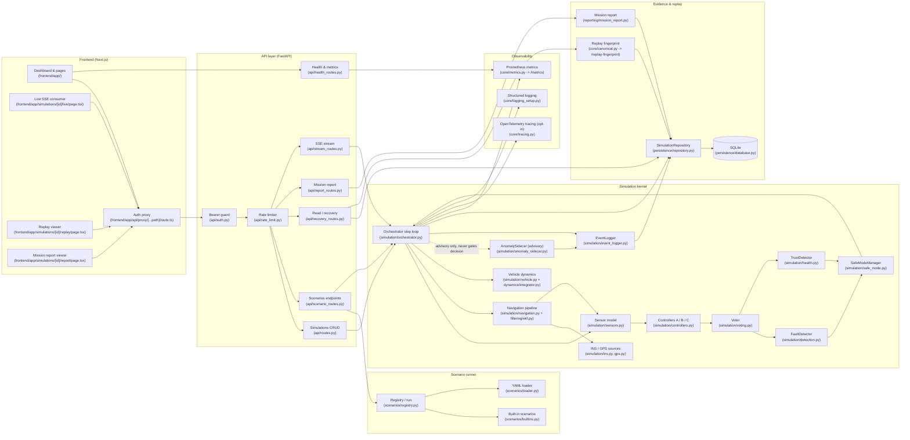

# DriftGuard Architecture Diagram

This diagram is generated from a code-walkthrough of the repository as it
currently exists; it is not an idealized target architecture. Every node
label includes the source file (or directory) so a reviewer can audit the
diagram against real modules. Edges represent actual call paths exercised
by `backend/app/simulation/orchestrator.py` and the FastAPI routers in
`backend/app/api/`. Where the runtime behavior is advisory or out-of-band
(for example the anomaly sidecar), the edge style and label make that
explicit.

## Legend / file map

- Frontend pages: `frontend/app/page.tsx`, `frontend/app/dashboard/page.tsx`,
  `frontend/app/scenarios/page.tsx`, `frontend/app/scenarios/new/page.tsx`,
  `frontend/app/simulations/[id]/page.tsx`,
  `frontend/app/simulations/[id]/live/page.tsx`,
  `frontend/app/simulations/[id]/replay/page.tsx`,
  `frontend/app/simulations/[id]/report/page.tsx`.
- Auth proxy: `frontend/app/api/proxy/[...path]/route.ts` injects the
  bearer token server-side so it never reaches the browser.
- API entrypoint: `backend/app/main.py` wires the routers above.
- Bearer guard scope: `api/auth.py::require_write_auth` is applied only to
  state-mutating endpoints (POST/DELETE); GET endpoints stay open by design.
- Replay fingerprint: `GET /simulations/{sim_id}/replay-fingerprint`
  hashes the canonical run record from `core/canonical.py`. Same seed and
  scenario produce the same hash.
- Anomaly sidecar: emits advisory events but `orchestrator.py` never
  consults its score when picking the final action; the voter, fault
  detector, trust detector and safe-mode manager are the only inputs to
  the gating decision.
- Persistence: a single SQLite file per replica
  (`persistence/database.py`), accessed via `SimulationRepository`. There
  is no shared state between replicas; see `docs/DEPLOYMENT.md` for the
  single-replica boundary.
- Observability: `/metrics` is always on; OpenTelemetry tracing is
  opt-in via environment configuration in `core/tracing.py`.
